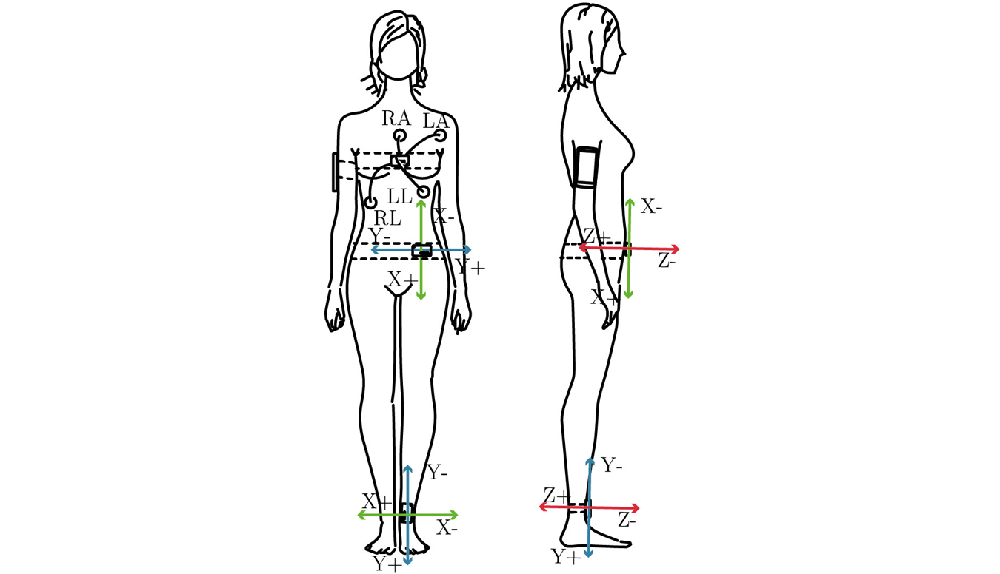

# Summary

Flow is widely understood as a source of creativity and innovation, physical and mental peak performances, and wellbeing. Individuals who experience flow tend to find the activity enjoyable and intrinsically rewarding [@Csikszentmihalyi2005]. In the research project “Flow-Machines: Body Movement and Sound” (2012-2015) funded by German Federal Ministry of Education and Research (BMBF) we addressed how flow while walking can be supported by means of mobile technology. Using the rewarding effect of flow on the future motivation to walk, Flow-Machines should help to change the sedentary lifestyle.

Our research activities are organized in three interconnected strands a) process-oriented modeling of walking, b) searching for implicit indices of flow while walking and running and c) supporting (flow-) experiences while walking [@Hajinejad2013]). Within the second strand, we searched for candidates for an implicit measurement method of flow-experience while walking and running.

Flow research is mainly based on explicit indices of flow extracted from interview or questionnaires. Future applications have to rely on implicit indices that allow us to design novel experiences and studying dimensions of embodied interaction. An implicit flow measurement measures flow-experiences without distraction the ongoing activity by a second or parallel activity.

In this paper, we present PsychoPhysioCollector [@Bogutzky2016a], a smartphone-based data collection app for psychophysiological research. The app allows high flexibility in designing and running sensor-enhanced experience sampling method (ESM) [@Larson1983] research protocols.

Alternative solutions to collect psychophysiological data while mobile activities are MyExperience [@Froehlich2007] and Psychlog [@Gaggioli2013a]. Both solutions are running on Windows mobile operation system. A commercial solution is a client-server system called Breakthrough Research [@BreakthroughResearch2016]. Researchers can create a survey on a web platform and present the questionnaires time-based or location-based in an app for the Android OS or iOS. The solution supports localization by GPS, but no additional sensors.

We developed the PsychoPhysioCollector to support the new generation of Smartphones and additional sensors. The PsychoPhysioCollector provides native support for Shimmer R2 inertial measurement unit (IMU)s with Shimmer ECG-Modul and Shimmer Gyro-Modul and Zephyr BioHarness 3 [@Zephyr2016], and its visualization component allows checking the experimental setup in real time.

The latest released version (2.0.5) of the PsychoPhysioCollector provides only one questionnaire, the Flow-Short-Scale (FKS) [@Rheinberg2003], but researchers can easily add new questionnaires as .json documents by using Android Studio or another proper android development tool. The sensing/computing component can be easily set up and configured to sample data in combination with self-reports, allowing researchers to correlate physiological, kinematical and subjective variables, as well as to analyze fluctuations over time.

We used the PsychoPhysioCollector to collect ECG data, accelerations and angular velocities to identify physiological characteristics of the flow-experience while walking and running [@Bogutzky2014]. Figure 1 shows the equipment placed on a participant in our walking study.

# References
